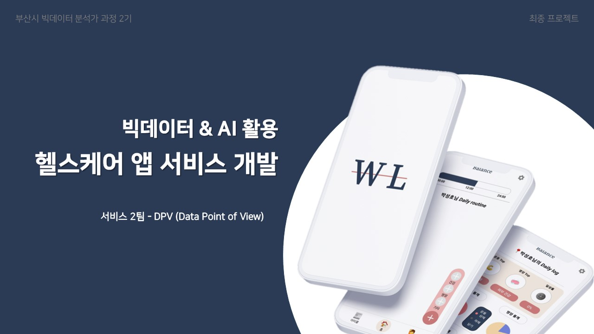
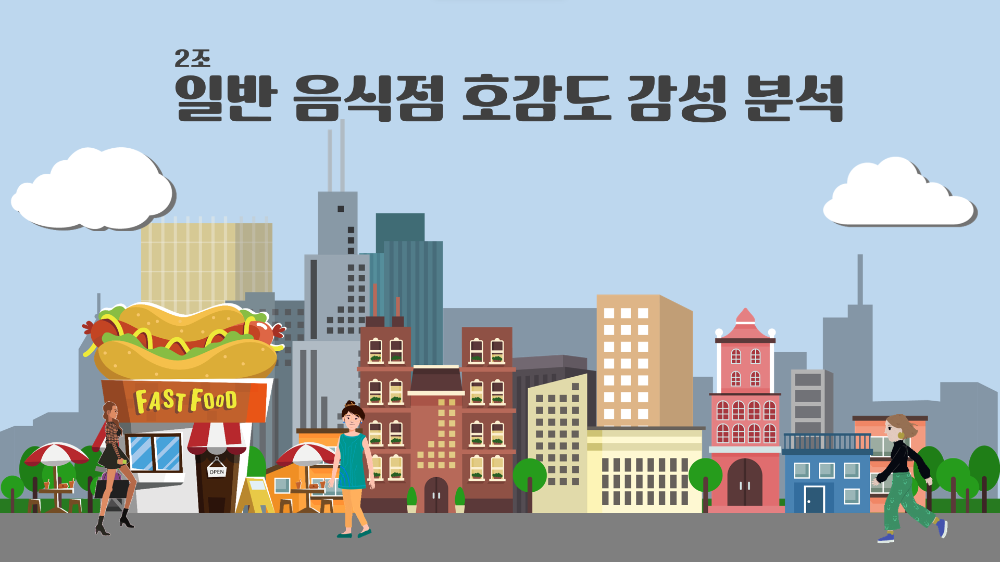
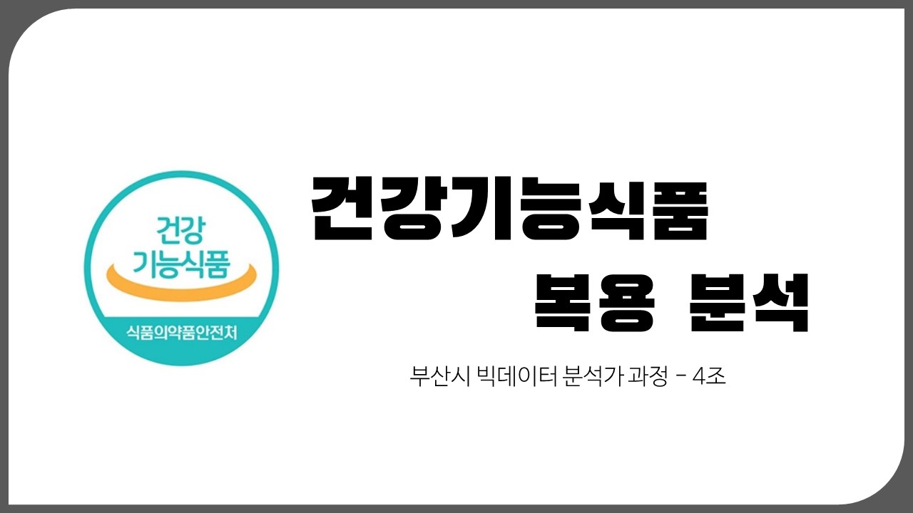
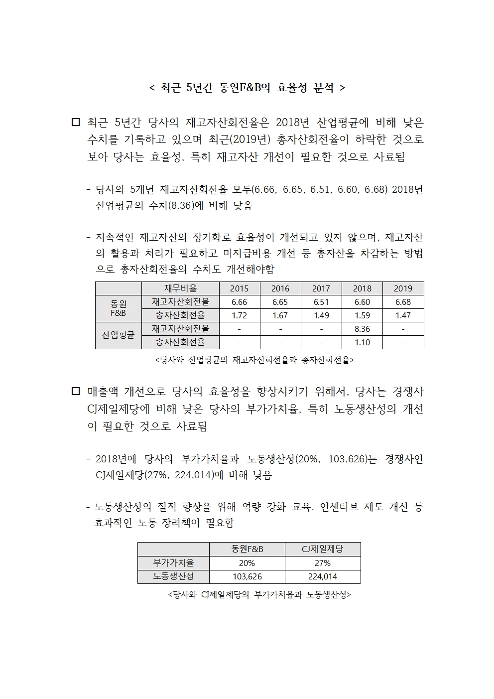
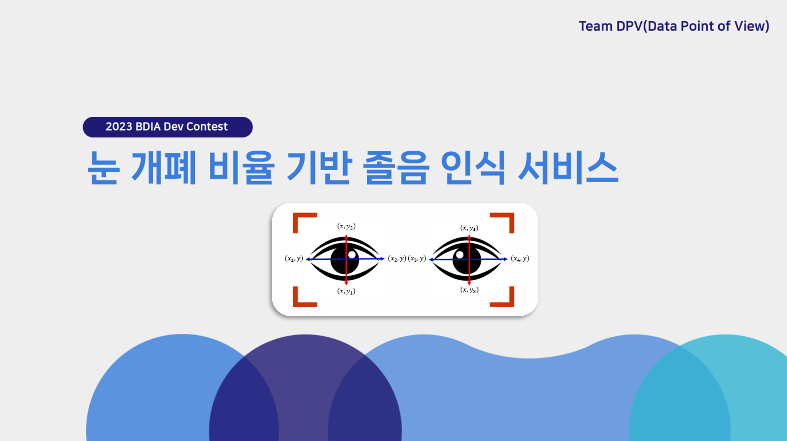

  <code>Hello, I'm KyeongMin</code>

<h3 align="center">" Target & Data-based로 데이터 바라보기 "</h3>
<li align="center">2번의 브랜딩으로 체득한 Target & Data 기반 의사결정</li>
<li align="center">3가지 Role 경험으로 다양한 직군과의 소통 가능</li>

<i>(Data Anlayst, Marketer, Designer)</i>

 

<pre align="center">
  ↓
  [python] def <i>name_KyeongMin</i><b>( target, data )</b>:
  return <b>DataAnalysis</b>
</pre>

  

  <h2>>> Tech Stack </h2>
   
   
   
   
   
    
      
      
    
   
    
    
    
    
   
   
    
      
      
    

   

  <h2>>> Projects</h2>
  <pre><strong>Analysis 분석 프로젝트</strong></pre>
  <table>
    <tr>
      <td align="center">
        <b>영양제 복용행태 분석</b>
        <a href="https://github.com/2kilometer/BusanBD_final">🔗</a>
      </td>
      <td align="center">
        <b>GIS데이터 활용, 이용자 분석</b>
        <a href="https://github.com/2kilometer/BusanBD_mini3">🔗</a>
      </td>
      <td align="center">
        <b>건강기능식품 가설검증 분석</b>
        <a href="https://github.com/2kilometer/BusanBD_mini2">🔗</a>
      </td>
    </tr>
    <tr>
      <td width="30%">
      </td>
      <td width="30%">
      </td>
      <td width="30%">
      </td>
    </tr>
    <tr>
      <td align="center">
        <b>OpenAPI 해양정보 수집 및 통합</b>
        <a href="https://github.com/2kilometer/BusanBD_mini1">🔗</a>
      </td>
      <td align="center">
        <b>OpenAPI 기업재무데이터 분석</b>
        <a href="https://github.com/2kilometer/personal_project">🔗</a>
      </td>
      <td align="center">
        &nbsp;
      </td>
    </tr>
    <tr>
      <td width="30%">
      </td>
      <td align="center">
      </td>
      <td width="30%">
        &nbsp;
      </td>
    </tr>
  </table>
  
  <pre><strong>Service 개발 프로젝트</strong></pre>
  <table>
    <tr>
      <td align="center">
        <b>헬스케어 데이터 운영계</b>
        <a href="https://github.com/FINAL-BUSAN-2/DataPointOfView">🔗</a>
      </td>
      <td align="center">
        <b>졸음운전 감지 모델</b>
        <a href="https://github.com/2kilometer/BDIA_DevContest">🔗</a>
      </td>
      <td align="center">
        &nbsp;
      </td>
    </tr>
    <tr>
      <td width="30%">
      </td>
      <td width="30%">
      </td>
      <td width="30%">
        &nbsp;
      </td>
    </tr>
  </table>

   

  <h2>>> Study</h2>
  <li>Coding Test 소스코드 정리 <a href="https://github.com/2kilometer/CodingTest">🔗</a></li>

  
